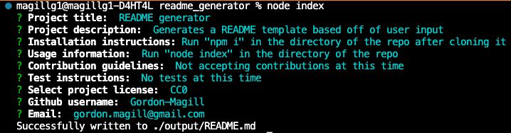

# README generator

## Description

Generates a README template based off of user input. Uses the npm "inquirer" package to solicit input and then formats that content into a README to avoid having to do the basics of README generation repeatedly for each project.

A sample README generated with this tool is present in the "output" folder (also where new README files will be generated, overwriting any existing files)

## Table of Contents

- [Installation](#installation)
- [Usage](#usage)
- [Credits](#credits)
- [License](#license)
- [Tests](#tests)
- [Contributing](#contributing)
- [Questions](#questions)
- [License](#license)

## Installation

Run "npm i" in the directory of the repo after cloning it. Ensure that node.js is installed prior to use. Verified on node v16.17.0.

## Usage

Run "node index" in the directory of the cloned repo. Answer prompts in the terminal as they are supplied.

Video demonstration:
https://www.youtube.com/watch?v=SproceGi4oE

## Contributing

Not accepting contributions at this time. Feel free to fork and modify in accordance with the license.

## Questions

[Github: Gordon-Magill](https://github.com/Gordon-Magill) 
Email: gordon.magill@gmail.com

## License

Licensed under [CC0](http://creativecommons.org/publicdomain/zero/1.0/).

